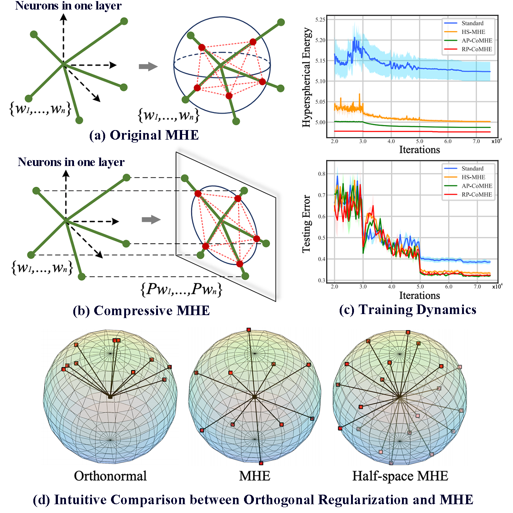

# Regularizing Neural Networks via Minimizing Hyperspherical Energy, CVPR 2020

By Rongmei Lin, Weiyang Liu, Zhen Liu, Chen Feng, Zhiding Yu, James Rehg, Li Xiong, Le Song

### Introduction
Inspired by the Thomson problem in physics where the distribution of multiple propelling electrons on a unit sphere can be modeled via minimizing some potential energy, hyperspherical energy minimization has demonstrated its potential in regularizing neural networks and improving their generalization power. In this paper, we first study the important role that hyperspherical energy plays in neural network training by analyzing its training dynamics. Then we show that naively minimizing hyperspherical energy suffers from some difficulties due to highly non-linear and non-convex optimization as the space dimensionality becomes higher, therefore limiting the potential to further improve the generalization. To address these problems, we propose the compressive minimum hyperspherical energy (CoMHE) as a more effective regularization for neural networks. Specifically, CoMHE utilizes projection mappings to reduce the dimensionality of neurons and minimizes their hyperspherical energy. According to different designs for the projection mapping, we propose several distinct yet well-performing variants and provide some theoretical guarantees to justify their effectiveness. Our experiments show that CoMHE consistently outperforms existing regularization methods, and can be easily applied to different neural networks.



### Requirements
1. `Python 3.6` 
2. `TensorFlow 1.14.0`

### Usage

#### Part 1: Clone the repositary
```Shell  
git clone https://github.com/rmlin/CoMHE.git
```
#### Part 2: Download official CIFAR-100 training and testing data (python version)
```Shell  
wget https://www.cs.toronto.edu/~kriz/cifar-100-python.tar.gz
```

#### Part 3: Train and test with the following code
```Shell  
python train.py
```
please refer to the code for details of parameters such as dimension and number of projections

### Citation

If you find our work useful in your research, please consider to cite:

    @InProceedings{Lin20CoMHE,
        title={Regularizing Neural Networks via Minimizing Hyperspherical Energy},
        author={Lin, Rongmei and Liu, Weiyang and Liu, Zhen and Feng, Chen and Yu, Zhiding 
         and Rehg, James M. and Xiong, Li and Song, Le},
        booktitle={CVPR},
        year={2020}}
